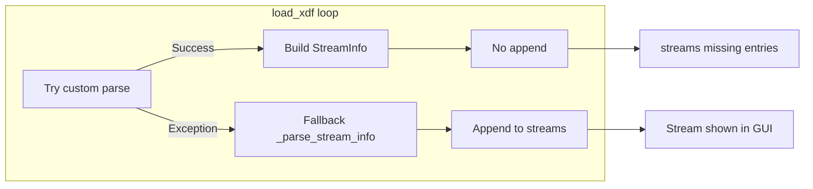

# Fix broken loading of EEG/Position plots

## Root cause

In [src/xdf_streamer/core/xdf_loader.py](src/xdf_streamer/core/xdf_loader.py), the `load_xdf` loop has a logic bug introduced in the “conversion to use more PhoOfflineEEG-like methods” commit (d59c707, Feb 10):

- When **custom parse succeeds** (`_try_pho_custom_parse_stream_info` returns a tuple and `StreamInfo(**stream_info_dict)` is built), `parsed_stream_successfully` is set to `True` but **the new `stream_info` is never appended** to `self.xdf_data.streams`.
- **Only the failure path** (lines 87–90) appends: `if not parsed_stream_successfully: ... self.xdf_data.streams.append(stream_info)`.

So streams that parse successfully (typically EEG, Position, and other “good” streams) never get added to `xdf_data.streams`. The GUI populates the tree and enables streaming from `self.xdf_data.streams` ([main_window.py](src/xdf_streamer/gui/main_window.py) lines 259, 341, 418, 425), so those streams never appear and their plots don’t load.

## Fix

1. **Append on success**
  In `load_xdf`, after the `try/except` block, when custom parse succeeded, append the built `stream_info`:
  - Add an `else` (or equivalent) so that when `parsed_stream_successfully` is `True`, call `self.xdf_data.streams.append(stream_info)`.
   Minimal change: add the append in the success path so that both paths (success and failure) end up appending exactly one `StreamInfo` per stream that is not skipped.
2. **Optional: handle `None` return**
  `_try_pho_custom_parse_stream_info` can return `None` for empty or skipped streams (lines 263–267). The current code would then raise when unpacking `None` into three variables. If you want to support that case cleanly, assign the result to a variable, check for `None`, and `continue` the loop without unpacking and without writing `time_series[stream_id]` for that stream, so stream indices stay aligned with `streams`.

## Files to change

- **[src/xdf_streamer/core/xdf_loader.py](src/xdf_streamer/core/xdf_loader.py)**  
  - In the `for stream_id, stream in enumerate(streams):` loop (around lines 72–97):  
    - When `parsed_stream_successfully` is `True`, call `self.xdf_data.streams.append(stream_info)`.  
    - Optionally: call custom parse into a single variable; if it is `None`, `continue`; otherwise unpack and proceed (and keep the same append logic for both success and fallback).

## Verification

- Load an XDF that contains EEG and Position streams.
- Confirm the stream tree shows all expected streams (EEG, Position, etc.).
- Confirm starting streaming and/or “good plots” (EEG/Position) work as before.

