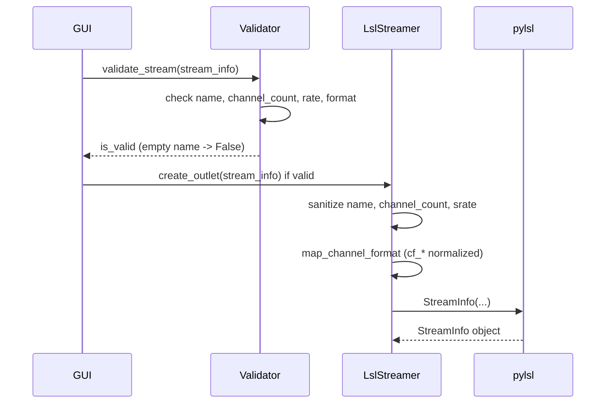

# Fix LSL "could not create stream description object" on XDF rebroadcast

## Root cause

The failure occurs in [lsl_streamer.py](src/xdf_streamer/core/lsl_streamer.py) when calling `pylsl.StreamInfo(...)`. The underlying C API `lsl_create_streaminfo` returns NULL when:

- **Stream name is empty** — LSL requires a non-empty name.
- **channel_count &lt; 1** — LSL requires at least one channel.

Current code does not enforce a non-empty `name` before creating the outlet. [validators.py](src/xdf_streamer/utils/validators.py) checks `channel_count` and sampling rate but does **not** check for empty `name`, so a stream with `name == ""` can pass validation and then fail inside pylsl.

Additional robustness: XDF/pyxdf often store channel format as `"cf_float32"` while [format_converter.py](src/xdf_streamer/utils/format_converter.py) only maps `"float32"`, etc. If the custom parse path ever passes the raw XDF format string, `map_channel_format` would raise `ValueError`; normalizing the string (strip `cf_` prefix) in one place avoids that.

## Implementation

### 1. Sanitize LSL inputs in `_configure_stream_metadata` ([lsl_streamer.py](src/xdf_streamer/core/lsl_streamer.py))

- **Name**: If `stream_info.name` is empty or only whitespace, set a fallback (e.g. `"UnnamedStream"` or `"Stream"`) before calling `pylsl.StreamInfo`. This is the minimal fix that prevents the C library from rejecting the call.
- **channel_count**: Coerce to a plain Python `int` and clamp to `max(1, channel_count)` so LSL never receives 0 or negative (defensive; validators already reject these for the GUI path).
- **nominal_srate**: Coerce to `float` and ensure it is finite (e.g. use `pylsl.IRREGULAR_RATE` or 0.0 if not finite) so the C library never receives NaN/Inf.

Keep all changes in this one method so the rest of the pipeline stays unchanged.

### 2. Normalize channel format before mapping ([format_converter.py](src/xdf_streamer/utils/format_converter.py) or [lsl_streamer.py](src/xdf_streamer/core/lsl_streamer.py))

- In `map_channel_format`, if the input string starts with `"cf_"`, strip that prefix before lookup (e.g. `"cf_float32"` → `"float32"`). This makes XDF-loaded streams (custom or fallback parse) work regardless of whether the stored format uses the `cf_` prefix.
- Prefer doing this inside `map_channel_format` so all callers (GUI synthetic stream and XDF rebroadcast) benefit with a single rule.

### 3. (Optional) Reject empty name in `validate_stream` ([validators.py](src/xdf_streamer/utils/validators.py))

- Add a check: if `not (stream_info.name or "").strip()`, return `(False, "Stream has no name")`. This prevents the GUI from offering streams that would later fail at LSL creation and gives a clear message. Low risk and improves UX.

## Files to touch

| File                                                                                     | Change                                                                                                                                                                 |
| ---------------------------------------------------------------------------------------- | ---------------------------------------------------------------------------------------------------------------------------------------------------------------------- |
| [src/xdf_streamer/core/lsl_streamer.py](src/xdf_streamer/core/lsl_streamer.py)           | In `_configure_stream_metadata`: sanitize name (fallback if empty), coerce channel_count to int and clamp to ≥ 1, coerce nominal_srate to float and handle non-finite. |
| [src/xdf_streamer/utils/format_converter.py](src/xdf_streamer/utils/format_converter.py) | In `map_channel_format`: normalize input by stripping a leading `"cf_"` prefix before format lookup.                                                                   |
| [src/xdf_streamer/utils/validators.py](src/xdf_streamer/utils/validators.py)             | In `validate_stream`: return invalid when stream name is empty or whitespace.                                                                                          |

## Flow after fix

## Testing

- After changes, run the GUI and load the same XDF file; start streaming for stream 0. Creation should succeed (or, if the stream has no name, it should be rejected by the validator with a clear message, or given a fallback name and then succeed).
- If possible, run existing tests (e.g. [tests/test_lsl_streamer.py](tests/test_lsl_streamer.py)) to ensure no regressions; add a small test that creates an outlet with an empty name and expects either a fallback name or a clear validation failure.

